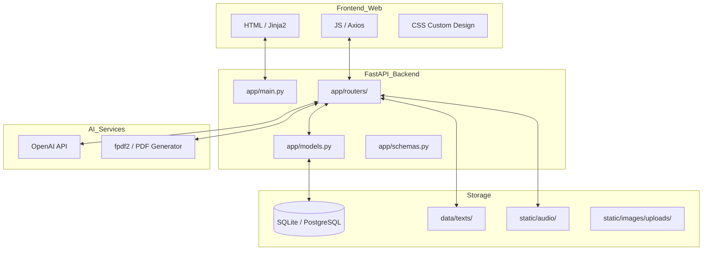

# 🏗 Arquitectura de Aula CL

Aula CL es una aplicación web educativa basada en **FastAPI**, **SQLAlchemy** y **Jinja2**, diseñada para facilitar la comprensión lectora multitipo.

---

## 🏛 Diagrama de Arquitectura

---

## 📂 Propósito de los Módulos del Backend

| Módulo | Responsabilidad |
| :--- | :--- |
| `app/routers/reading.py` | Gestión de lecturas, subida de archivos, sincronización de audios y generación automática de preguntas con IA. |
| `app/routers/auth.py` | Autenticación basada en tokens JWT y manejo de sesiones para profesores/padres. |
| `app/routers/subusers.py` | Gestión de cuentas de estudiantes ligadas a una cuenta principal (Parent/Teacher). |
| `app/routers/analytics.py` | Procesamiento estadístico de los resultados de los estudiantes por categoría pedagógica. |
| `app/limiter.py` | Control de tasa (Rate-Limiting) para evitar abusos en los endpoints públicos. |
| `app/security_utils.py` | Utilidades para cifrado y hashing de contraseñas y códigos de login. |

---

## 🔁 Flujo de la Aplicación

1.  **Registro/Acceso**: El profesor se registra y crea una cuenta.
2.  **Gestión de Estudiantes**: Crea perfiles de estudiantes (Subusers) que acceden con un código simple.
3.  **Biblioteca**: El administrador sube textos (.txt). El sistema normaliza el texto y genera automáticamente preguntas de comprensión si no se proporcionan de forma manual.
4.  **Lectura**: El estudiante lee el texto, puede escuchar el audio sincronizado.
5.  **Cuestionario**: El estudiante responde preguntas clasificadas (Literal, Inferencial, etc.).
6.  **Analíticas**: El profesor visualiza gráficas de rendimiento del estudiante.

---

## ⚖️ Licencias y Desbloqueo

El sistema implementa un mecanismo de **licencias**:
- Las lecturas son gratuitas para la primera de cada nivel.
- El resto del contenido requiere una licencia activa ligada al estudiante o al profesor.

---

## 🧪 Estrategia de Testing

- **Tests de Integración**: Validan endpoints de la API y persistencia en DB.
- **Tests E2E**: Simulan acciones reales de usuario en el navegador (Login, Cambio de orden de lecturas, Guardado).

---
*Documento de arquitectura técnica de Aula CL.*
