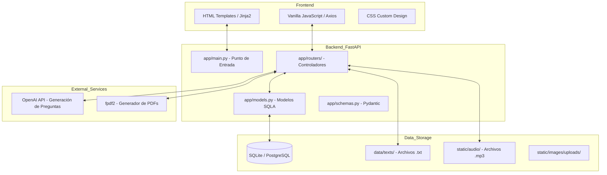

# 📚 Aula CL - Plataforma de Comprensión Lectora

Aula CL es una aplicación web educativa diseñada para mejorar la comprensión lectora en estudiantes de Primaria y la ESO. Combina un backend robusto con FastAPI, un frontend interactivo y herramientas de Inteligencia Artificial para la generación de contenido y evaluación.

---

## 🏗 Arquitectura del Sistema

La aplicación sigue un patrón de arquitectura monolítica modular, facilitando el despliegue rápido y la persistencia de datos localmente o en la nube.



---

## 📂 Estructura del Proyecto

Propósito de cada directorio y archivo principal:

| Carpeta / Archivo | Propósito |
| :--- | :--- |
| `app/` | **Núcleo del Servidor**. Contiene toda la lógica de negocio. |
| `app/main.py` | Configuración de FastAPI, middleware de sesión y rutas principales. |
| `app/routers/` | Módulos de API: `reading.py` (lecturas), `auth.py` (seguridad), `subusers.py` (estudiantes), `analytics.py` (estadísticas). |
| `app/models.py` | Definición de tablas de la base de datos (User, SubUser, Text, Question, etc.). |
| `data/` | Almacenamiento de contenido textual (.txt) organizado por niveles. |
| `static/` | Activos estáticos (CSS, JS, Imágenes, Fuentes). |
| `templates/` | Plantillas HTML renderizadas con Jinja2. |
| `tests/` | Pruebas de integración (`test_integration.py`) y End-to-End (`test_e2e.py`). |
| `requirements.txt` | Dependencias del proyecto (FastAPI, SQLAlchemy, OpenAI, FPDF2, etc.). |
| `init_db.py` | Script para inicializar la base de datos y sembrar datos de ejemplo. |
| `run.sh` | Script de ejecución rápida del servidor de desarrollo. |

---

## 🚀 Funcionalidades Principales

### 🔴 Gestión de Contenidos y Multilingüismo
- Biblioteca con lecturas en **Español, Inglés y Valenciano/Catalán**.
- Sistema de **Read-along** con audios sincronizados.
- Clasificación por niveles (1P, 2P... 1ESO, etc.).

### 🤖 IA Educativa ("Magic Writer")
- Generación automática de cuestionarios mediante OpenAI GPT-4o-mini.
- Clasificación pedagógica de preguntas (Literal, Inferencial, Vocabulario, Decodificación).

### 📄 Generación de PDFs Personalizados
- Exportación de lecturas con estilos de fuente específicos para educación:
  - **Imprenta**, **Ligada** (escolar) o **MAYÚSCULAS**.
  - Tamaños ajustables (S, M, L, XL).
  - Incluye cuestionarios y hojas de soluciones.

### 👤 Gestión de Estudiantes (Subusers)
- Los profesores/padres gestionan cuentas individuales para sus estudiantes.
- Acceso simplificado sin necesidad de correo electrónico.
- Seguimiento detallado del progreso por cada niño.

---

## 💻 Instalación y Uso Local

1.  **Clonar y Entorno**:
    ```bash
    git clone [url_repo]
    python3 -m venv venv
    source venv/bin/activate
    ```
2.  **Instalar dependencias**:
    ```bash
    pip install -r requirements.txt
    ```
3.  **Preparar Base de Datos**:
    ```bash
    python3 init_db.py
    ```
4.  **Ejecutar**:
    ```bash
    ./run.sh
    ```
    La aplicación estará disponible en `http://localhost:8000`.

---

## 🛠 Requisitos de Ejecución

- **Backend**: Python 3.10+, FastAPI, SQLAlchemy.
- **Frontend**: HTML5, CSS3, JavaScript (Vanilla).
- **IA**: OPENAI_API_KEY (configurada en `.env`).
- **Tests**: Playwright (`pytest tests/test_e2e.py`).

---
*Documentación actualizada automáticamente.*
